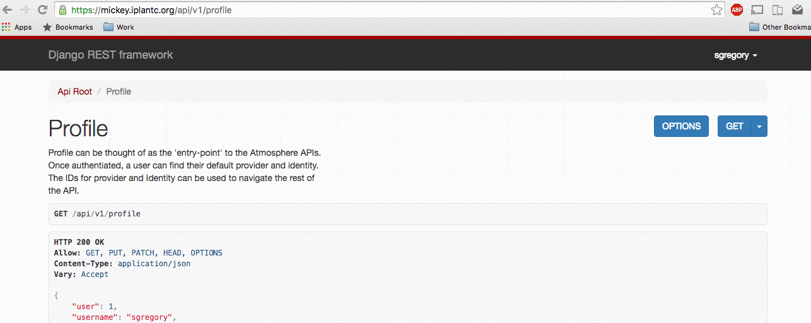

# <a name="emulate">Emulating a user through Troposphere</a>

#### To emulate a user, you must first log in to Troposphere as a staff user.

After logging in as a staff user, navigate to `https://<your_url>/application/emulate/<username>`

From here, you will be able to perform actions through the Troposphere UI as if you were logged in as the user you are emulating.

#### Unemulate a user:
When done emulating a user, you can either navigate to `https://<your_url>/application/emulate/<your_username>` or `https://<your_url>/application/emulate` with no username after `emulate.`

How to emulate a user on Troposphere via the URL `https://<your_url>/application/emulate/<username>`:  

# <a name="emulate">Emulating a user through the API</a>

#### To emulate a user, you must first log in to Atmosphere API as a staff user. 
Note: If your site does **NOT** handle username/password validation (No LDAP) then a user/password combination must be created through Django first. The user must also have marked `is_staff` and `is_superuser` true.

After logging in as a staff user, navigate to `https://<your_url>/api/emulate/<username>`

From here, you will be able to perform actions through the Troposphere UI as if you were logged in as the user you are emulating.

#### Unemulate a user:
When done emulating a user, you can either navigate to `https://<your_url>/api/emulate/<your_username>` or `https://<your_url>/api/emulate` with no username after `emulate.`

How to emulate a user on the Atmosphere API via the URL `https://<your_url>/api/emulate/<username>`:  

