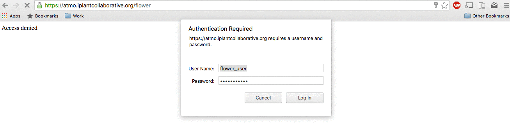

# Flower
To check flower, navigate to `https://<your_url>/flower` and log in using your flower credentials.

View the status of recent celery tasks by clicking on the "Tasks" tab.

View the fine-grained details of a task by clicking on the task `Name`. The most important details are:
`Traceback` (Finding the bug/failure), `Worker` (Finding the logs).

You can view tasks by status by clicking on the "Monitor" tab and clicking on your desired task state.

