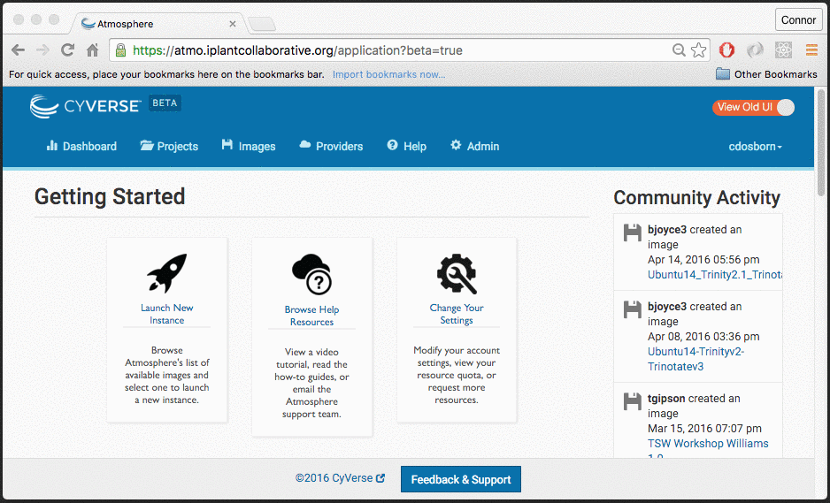

This will take you through the process of requesting additional resources.

# Navigate to the request form

# Requesting more resources

There are two forms of resources: **Allocation** and **Quota**. 

**Allocation** is a monthly allotment of time that we allow your virtual machines
to run. One of our allocation units (AU) is an hour per cpu of your machine. A
16 cpu machine will consume 16X what a 1 cpu machine would consume of your
total AU budget.

---
WHERE CONNOR LEFT OFF

Describe the process, step by step, of how to move from the Dashboard to the form where a user requests additional quota.
Describe the process that happens *AFTER* a quota request has been made, as well as any restrictions (Can't create another)...

# Requesting more Allocation

Describe the process, step by step, of how to move from the Dashboard to the form where a user requests additional allocation.
Describe the process that happens *AFTER* an allocation request has been made, as well as any restrictions (Can't create another)...
